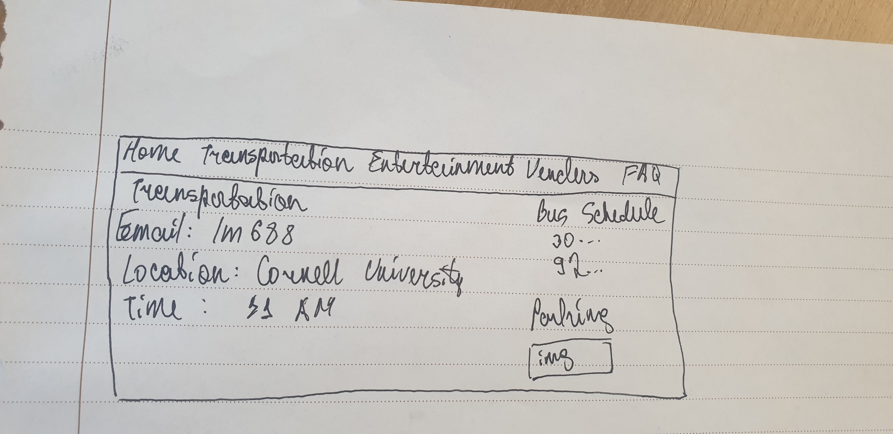

# Project 1: Design Journey

**For each milestone, complete only the sections that are labeled with that milestone.** Refine all sections before the final submission.

You are graded on your design process. If you later need to update your plan, **do not delete the original plan, leave it in place and append your new plan _below_ the original.** Then explain why you are changing your plan. Any time you update your plan, you're documenting your design process!

**Replace ALL _TODOs_ with your work.** (There should be no TODOs in the final submission.)

Be clear and concise in your writing. Bullets points are encouraged.

**Everything, including images, must be visible in _Markdown: Open Preview_.** If it's not visible in the Markdown preview, then we can't grade it. We also can't give you partial credit either. **Please make sure your design journey should is easy to read for the grader;** in Markdown preview the question _and_ answer should have a blank line between them.

## Markdown Instructions

## Existing Design (Milestone 1)

**Make the case for your decisions using concepts from class, as well as other design principles, theories, examples, and cases from outside of class (includes the design prerequisite for this course).**

You can use bullet points and lists, or full paragraphs, or a combo, whichever is appropriate. The writing should be solid draft quality.

### Existing Site: The Site (Milestone 1)
> What is your existing site about? Tell us about it.

tell us about your website:

This is a website for Ithaca Harvest Apple Festival.

> How and where did you create this site?

tell us how you created it:

I created this website last semester for Info 1300 alone

> Is this site designed for desktop, mobile devices or both?

mobile AND desktop

> Explain with this website is a **static** website.

This is a static website as the website content is the same regardless of who is the user.

### Existing Site: Audience (Milestone 1)
> Briefly explain your site's audience.
> Be specific and justify why this audience is a **cohesive** group.

site's _cohesive_ audience (copied from my design journal for info 1300 project 3)

 The audience is people who are ultimately interested in attending the Apple Festival. The majority of the intended audience is from Ithaca (people who live/work/study in Ithaca) however the website does not exclude the people who might be visiting from other towns as well. Additionally, students here always have visitors, and we want to make sure that those people as well have accssible information about the festival. For that purpose, the website has information both the very specifics of the festival and other activities that the visitos can do in Ithaca. The website does not assume any previous knowledge of the festival, as it starts telling the user about the festival right away. But if the user already has some general information and just wants to find something specific, they can skip that information and surf the website using the navigation bar to find the information that they need. To sum up, the audience of the website are people who want to attend the festival both Ithaca residents and people who are either visiting someone that lives in Ithaca or are just from neighboring towns. The audience is not assumes any background knowledge on the festival. There are no age imitations on the audience.

### Existing Site: Audience Goals (Milestone 1)
> Document your existing site's audience's goals. (These should be informed by user research. Not assumptions or stereotypes.)
> List each goal below. There is no specific number of goals required for this, but you need enough to do the job (Hint: It's more than 1 and probably more than 2).

(copied from my design journal for info 1300 project 2)

Goal 1: Entertainment

- **Design Ideas and Choices** _How will you meet those goals in your design?_
  - design ideas:
  - Content about what is going to be in the festival, lots of past pictures, bright colors
- **Rationale & Additional Notes** _Justify your decisions; additional notes._
  - rationale:
  - I think the content should be centered around entertainment, as opposed to around specific apple types that will be sold or bus schedule because from the answers that I have gathered it doesn't look like those people want to attend or attended the festival to try as many types of apple as possible, bu they wanted to have fun with their close people and entertain themselves. Hence, I think showcasing the crafting shops and any activities would be a good idea in the content. Additionaly, I think adding pictures would be a proof and a convincing element that would also let people have a great idea what to expect during the festival.

Goal 2: Taking a break/resting

- **Design Ideas and Choices** _How will you meet those goals in your design?_
  - design ideas:
  - Content about food, drinks, photos, links to the external pages. The colors should be restful and not formal.
- **Rationale & Additional Notes** _Justify your decisions; additional notes._
  - rationale:
  - I think content yet again should be around the rewarding aspects, such as food and drinks, and activities. As opposed to being very detailed informative. Because from my interviews it looks like nobody checks the website to see, for example, what buses go there, or the each and very individual vendor name, but they want to go to the festival to explore and to take a break from the university life. I think in terms of the colors it should be playful because people do not expect the festival to be a formal event, instead they expect it to be an opportunity to make connections and to take a break.

Goal 3: Connecting with the community and the friends/family

- Design ideas:
- Mention which groups are going to be present, mention where the money collected would go (especially if there is any cause or any fundraiser present), mantion any activities or games, volunteer opportunities during the festival
- Rationale:
- Even though this goal is not completely explicit from the written answers, many people that I have asked about the festival and one person in particular whom I have interviewed, were interested in exploring especially Ithaca and seeing what opportunities are out there and what organizations are present.

### Existing Site: Design/Sketches (Milestone 1)
> Sketch your existing site. Include these sketches here.
> **You may not copy your sketches from a previous assignment.**
> Why can't you copy the sketches? I want to get you thinking about the strengths/weaknesses of the current design.
> Provide an explanation _underneath_ each sketch explaining the sketch and any design patterns you are leveraging.

A sketch + explanation for each webpage

All the wide screens have the same horizontal navigation bar that becomes a hamburger menu in the narrow screens. This is a common practice.
Home page includes a photo of apples to visully introduce the theme and the topic of the festival, as well as the name of the festival and short information about the festival, dates, and location. The dates and time for the narrow screen move under the photo so the user does not scroll horizontally to see that information. This is to accommodate for the narrow screen.
Entertainment page includes an example photos of entertainment as well as all the dates, times, and locations of each entertainment activity. There are also chunks of text to better explain what other activities are there in Ithaca.
Vendors page introduces all the vendors divided to categories so that people do not have to surf long lists of every vendors but instead can see the ones that they are interested in.
Vendors page has galleries to display all the relevant images without taking too much space on the screen.
FAQ page includes all the frequently asked questions and their answers. It has accordion to make it easy for the users to find the question that they are interested in and not to have to read every single question with its respectful answer.

## Milestone 1 Feedback Revisions (Milestone 2)
> Explain what you revised in response to the Milestone 1 feedback

milestone 1 feedback revisions:

My milstone 1 feedback stated that I met all the requirements and there was a good process towards to the project. It did not indicate anything to change. Hence, I have not changed anything since.

## Refined Design (Milestone 2)

### Refined Design: Persona (Milestone 2)
> Use the goals you identified above from your prior user research to develop a persona of your site's audience.
> Your persona must have a name and a face. The face can be a photo of a face or a drawing, etc.
> You may type out the persona below with bullet points or include an image of the persona. Just make sure it's easy to read the persona when previewing markdown.

Persona's Name: Anna

persona details:

I have chosen this picture to represent Anna because she is also as sleep-deprived as we - Cornell and overall students - are.
The image is downloaded from an open source in Pinterest.

Personal information:
- Anna is a student in Ithaca.
- She is 19 years old.
- Anna likes eating out and hanging out with friends.
- Anna is a low budget student who has a scholarship at her university.

Needs/wants/desires
- Anna wants to find a place to have fun and spend some quality time with her friends.
- Anna looks for food and bevarages while choosing a place to go.
- Anna needs an accessible location as she doesn't own a car.
- Anna needs low prices if she is to buy something.

Obstacles:
- Anna is a low income student, hence expensive costs is one of the main obstacles for her to attend an event.
- Anna doesn't have a car, hence she needs a transportation to move to the events.
- Anna is a student, therefore the timing of the event is important for her. She cannot attend an event if it is early in the morning when she has a class or later at night, as she has to sleep early for the next day.
- Anna is underage, hence she cannot attend events that require people to be over 21.

### Refined Design: Mobile or Desktop (Milestone 2)
> Will your refined design be functional on mobile, tablet, or desktop devices?

how will your persona access your website?

Desktop design

### Refined Design: Form Brainstorm (Milestone 2)
> Brainstorm ideas for collecting data from your persona on your website.
> The form must support the persona's goals when using the website.
> For each form idea, explain how the form supports the goals of the persona.
> **Refer to the persona by name.**

list about 3 ideas for including a form on your website

Form idea one: The festival provides trasportation to the event and collects information about when is the best time to pick up people. Additionally, it also collects infrmation about the most popular spots to pick up people from so that it can create a route of the transportation. This supports Anna's goals as she wants to go to the festival but cannot do so without an accessible transportation. Therefore, by filling out this form she will indicate her need of transportation and most likely will be accommodated by the festival.

Form idea two: Asking for allergens to be able to accommodate for during the festival. If Anna has allergy from cheese, the festival needs to have that information to have cheese-free food options at place. This fulfills Anna's goals as she wants to have food, however she would not be able to do so if all the food available contains alergens.

Form idea three: Subscribing to the email list to be able to receive news and notifications about any updates in the festival. This meets Anna's goals as she will be able to get notified about any entertainment and vendor activities during the festival and base her decision about attending the events on those notifications.

### Refined Design: Content (Milestone 2)
> List **all** the content you plan to include your website for your **persona**.
> You should list all types of content you planned to include (i.e. text, photos, images, etc.)
> List the content here. Label the content as "(new)" if it's new to the existing site.

- content 1: Apple images
- content 2: Entertainment activity images
- content 3: Cider images
- content 4: Pie images
- content 5: transportation information
- content 6: form to submit transportation request
- content 7: FAQ
- content 8: map of parking
- content 9: location
- content 10: times
- content 11: all the activities
- content 12: all the vendors
- content 13: prices
- content 14: age restriction
- content 15: student benefits and discounts
- content 16: festival description
- content 17: contact information

### Refined Design: Content Justification (Milestone 2)
> Explain why this content supports the goals of your persona.
> **Refer to the persona by name.**

content justification:
Anna is interested in food, beverages, and activities. Hence, there are all the lists and descriptions of all the possible activities (with their times and locations) and vendors. Photos provide visual information about the food and activities in case Anna doesn't recognize any of the names. Prices are included because Anna is conscious about prices. Transportation is a major obstacle for Anna, therefore all the possible ways of transportation is included as well (including form to submit a transportation request, buses, and parking location). Because Anna is underage, she cannot use/buy anu hard ciders, therefore that piece of content is also included. However, that is not an obstackle for Anna to miss the festival as besides all the beverages that contain alcohol, she can participate in any activities and buy anuthing else offered. That is also displayed within the age limitation content. Additionally, Anna is a student, and as many events and organizations give student discounts and benefits, Anna also is curious weather she can get any special offers. Festival location and hours, as well as the description is specified to help Anna make up her mind about going to the festival.

### Refined Design: Content Organization (Milestone 2)
> Organize the content for the audience and identify possible pages for the content using **multiple iterations** of card sorting.
> Include photographic evidence of each iteration of card sorting **and** a explanation of your thought process for each iteration.
> **Please physically sort cards;** please don't try and do this digitally.
> **Refer to the persona by name.**

iterations of card sorting

During the first iteration (which is named 'iteration two' for the file organizational purposes) I was trying to destribute the content that I have added based on Anna's desires and concerns to the other existing pages. I have added information/form about the transportation and prices. Hence, I have moved some of the transportation related content to the 'Home' and 'FAQ' pages and kept the prices in the 'FAQ' page. However, because they were inconsistent with the rest of the website I have done the second iteration and created a new transportation page that would have all the transportation related content. I have also moved prices to the vendors page because Anna would want to know what each product costs before buying it.

### Refined Design: Navigation (Milestone 2)
> Please list the pages you will include in your website's navigation.

- page 1: Home
- page 2: Vendors
- page 3: Entertainment
- page 4: Transportation
- page 5: FAQ

> Explain why the names of these pages make sense for your persona.

Home page is a common practice as all the web pages have the home page. The user can expect to see basic introductory information of the website. Vendors page makes sense as it lists and introduces all the vendors. Entertainment page is about all the entertaiment activities with their locations and times. Transportation name makes sense as it contains the form request for transportation as well as all the possible ways that one can reach the location of the festival. This is especially important as Anna is concerned about the lack of transportation. FAQ page name makes sense because it is a common practice and many pages have frequently answered questions page separately.

### Refined Design: Design (Milestone 2)
> Refine the design of your site to address the goals of your persona.
> Include iterations of **sketches** for each page of the refined design.
> Provide a brief explanation _underneath_ each sketch.
> Document your _entire_ design process. **Show your preliminary sketches and your final sketches.** **We want to see iteration!**
> **Refer to your persona by name in each explanation.**

sketches + explanation
Home page:

Added two partial outlines: navigation bar + the header and the contact information sidebar.
Ignore the phone screen as the website will be designed only for widescreens.

Added proces on the Vendor page because Anna is conscious of prices and would like to see the prices before committing to an activity.
Added two partial outlines: navigation bar + the header and the contact information sidebar.
Ignore the phone screen as the website will be designed only for widescreens.

Added two partial outlines: navigation bar + the header and the contact information sidebar.
Ignore the phone screen as the website will be designed only for widescreens.

Added two partial outlines: navigation bar + the header and the contact information sidebar.
Ignore the phone screen as the website will be designed only for widescreens.

Added a new transportation page as Anna is worried about the transportation as she doesn't own a car and having an accessible way of transportation can determine if she goes to the festival or not. Added transportation request form. Added the bus list/information on this page. Shifted the parking information from the FAQ page to the new transportation page.

The confirmation page displays the data that was collected from the user. Anna can see what data she has inputted and in the case of any mistyping she can correct it  submitting another form.

The error message page that is supposed to pop-up whenever Anna inputs incorrect route is written in a manner/words that don't assume any prior knowledge in web development or computing. Anna is a student however she is not an information science or computer science student and has never takenany coding courses. She doesn't have to know what "Error 404" means, therefore the website will display a friendly message explaining what went wrong and how she can re-routherself into a correct site. It is important that the message does not blame Anna for doing something wrong because otherwise that would be a bad user experience. For that reason, I have planned for the website to aplogize for the inconvinience. Because the website is not supposed to be very formal, the message too is not very formal. It is rather friendly. Additionally, I have planned to keep the same navigation bar and header to let Anna know that she is still on the same website. The suggested solution of how to redirect to the correct/desired website is to use the navigation bar to naviga out of the error messahe page.

### Partial Plan (Milestone 2)
> Using your refined sketches, plan your site's partials.
> You may describe each partial or sketch it. It's up to you!
> Explain how you will customize at least 1 partial.

partial plan:
One partioal would be the header and the navigation bar. I would customize this partial by echo-ing the variable of the page in the header. Anna would appreciate having these names on the header as it helps to navigate through the website.
The second partial would be contact information that would be a sidebar or a footer in every page. This would be helpful for Anna as she can find the contact information of the festival organizers' easily and quickly, in case she has to contact them and has questions that are not covered in the website.

## Milestone 2 Feedback Revisions (Milestone 3)
> Explain what you revised in response to the Milestone 2 feedback

milestone 2 feedback revisions:

- I have added Anna's (Anna is my persona) face to the design journey.
- I have added scetches for the error message page and the form confirmation page.
- Added partial files for the navigation bar + the header and the contact information side bar

## Form Design and Planning (Milestone 3)

### Refined Form Design (Milestone 3)
> Refine the design of your site's form to address the goals of your persona.
> Include iterations of **sketches** of the form and its confirmation message.
> Provide a brief explanation _underneath_ each sketch.
> **Refer to the persona by name.**

sketches + explanation:

In this iteration all the fields and labels are alligned to the left so Anna's eyes are directed from up to down in the same line. The submit button is on the bottom right of the form to direct Anna's eyes in a trajectory line that we discussed during the lecture. The radio buttons are in a horizontal line which takes less space on the form however it violates the proximity principle that would allow Anna to associate the right label with the right button. The problem that can arise here is that Anna would want to choose a button but because it is so hard to understand which button is associated with which label, she can accidently choose the wrong one.

This iteration of the form follows the allignment and the proximity principles of design. The allignment of all the elements is towards the left where one element is right below/above the neighboring one. It also follows the trajectory movement. Additionally, it is clear which field/button corresponds to which label, as unlike the previous iteration, in this one the radio buttons are in a vertical allignment.

In the third iteration of designing the form, I have changed the text field for inputting the location of pick up to be a drop down filed. For this desicion I had in mind that people might live in unorganized or far places hence it might be a good idea to limit the input options only to possible pick up locations. However, on the other hand, the route of the transportation is not certain yet, and limiting the options might leave out places that are popular among users like Anna and have high demand for pick up. Additionally, the website that does not guarantee a pick up but rather uses the information to organize the route, hence it is also a good idea to gather a fair/row data of all the locations that people would want to get picked up from.

In this iteration I have alligned the labels together and the fileds/buttons together. In this way, this form doesn't violate the allignment principle and Anna would still understand where to look and what is associated with what. Additionally, the radio buttons are also in a vertical allignment which improves the proximity and makes it easier to realize what button corresponds to what label while choosing the convinient time for the pick up.

For the final form decision I was contemplating between the second iteration and the last iteration as these were the ones that didn't violate the proximity principle and were not confusing to use. I decided to choose the forth iteration as it looks more optimal for the desktom than the second iteration. The allignment is horizontal rather than vertical: the labels are vertically alligned together and the fields and buttons are separately vertically alligned together so the principle of allignment still holds. However the labels and the fields are alligned horizontally filling out the space on the desktop/wide screen. I have also included the names of the buttons/fields. The email will use the email field (on the scetch it is indicated as text but later it has been changed) and the location will use the text field. The time will use radio buttons.

### Form Planning (Milestone 3)
> Will your form use a GET or POST request.
> Justify your decision as to why the request type is appropriate for the form.

GET/POST + justification:

The form will use a POST request because I will be asking for Anna's email address for the purposes of future communication and pick up information/details. Hence, because an email is a personal information as well as the location of where Anna potentially lives (doesn't have to be but most probably she will mention the place where she lives or spends time the most) and times where she is there. These are personal information that may not only annoy Anna once misused (such as subscribing for spam newsletters) but can also be dangerous. We don't want the whole internet to know where Anna lives/spends time and when people can find her. Hence, to secure the data, I will be using the POST request.

## Milestone 3 Feedback Revisions (Final Submission)
> Explain what you revised in response to the Milestone 3 feedback

TODO: milestone 3 feedback revisions

## Complete & Polished Website (Final Submission)

### Routing (Final Submission)
> Plan your HTTP routing.
> List each route and the PHP file for each route.

| Route       | PHP File                            |
| ----------- | ----------------------------------- |
| /           | pages/home.php (or pages/index.php) |
| TODO: route | TODO: php file                      |
| TODO: route | TODO: php file                      |

> Explain why these routes (URLs) are usable for your persona.

TODO: justification of routing design

### Refined Missing Resource Page (Milestone 3)
> Refine the design of your site's missing resource 404 page for your persona.
> Include iterations of **sketches** of the page.
> Provide a brief explanation _underneath_ each sketch.
> **Refer to the persona by name.**

TODO: sketches + explanation

### Accessibility Audit (Final Submission)
> Tell us what issues you discovered during your accessibility audit.
> What do you do to improve the accessibility of your site?

TODO: audit fixes

### Final Design + Audience Goals (Final Submission)
> Tell us how your final site addresses the gaols of the audience.
> Be specific. Tell us how you tailored your design, content, etc. to make your website usable for your persona.
> **Refer to the persona by name.**

TODO: rationale

### Self-Reflection (Final Submission)
> Take some time here to reflect on how much you've learned since you started this class. It's often easy to ignore our own progress. Take a moment and think about your accomplishments in this class. Hopefully you'll recognize that you've accomplished a lot and that you should be very proud of those accomplishments!

TODO: self-reflection

## Grading (Final Submission)

### Grading: Mobile or Desktop (Final Submission)
> When we grade your final site, should we grade this with a mobile screen size or a desktop screen size?

TODO: screen size

### Grading: Partials (Final Submission)
> Clearly list each partial file and where you used it.

- TODO: partial 1
- TODO: partial 2

> Which partials have customization? Explain how the customization looks in the browser.

- Example: header.php shows a border around the current page (TODO: delete this line)
- TODO: partial customization

### Collaborators
> List any persons you collaborated with on this project.

TODO: list your collaborators

### Reference Resources
> Please cite any external resources you referenced in the creation of your project.
> (i.e. W3Schools, StackOverflow, Mozilla, etc.)

TODO: list reference resources
